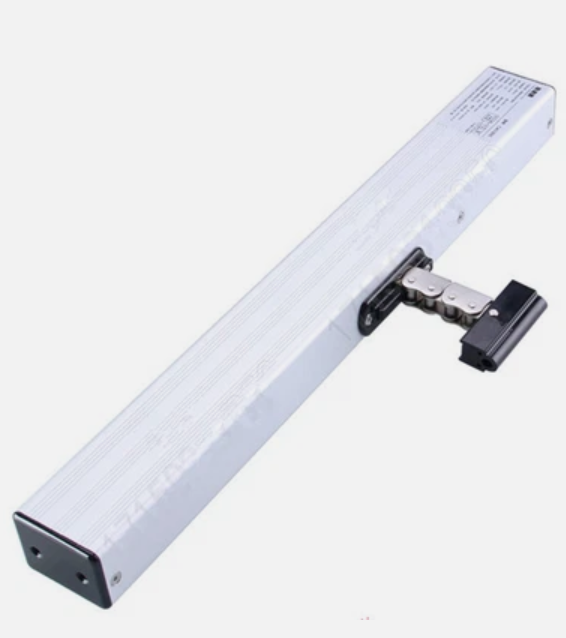
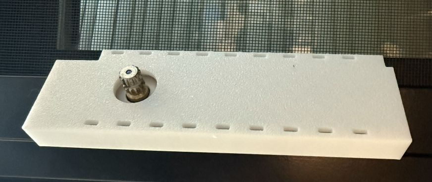
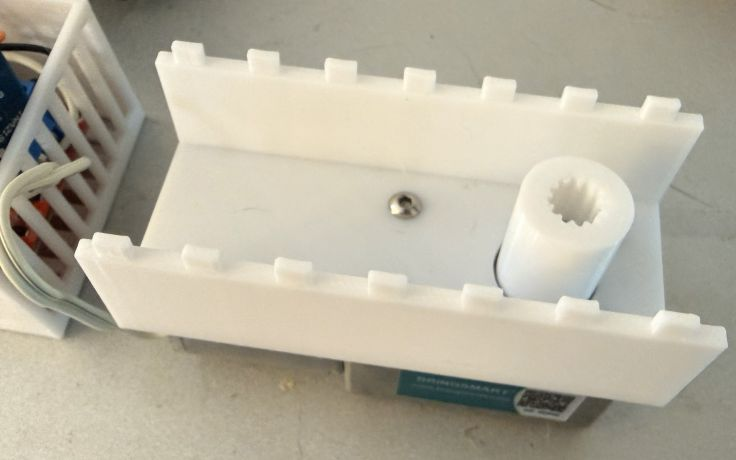
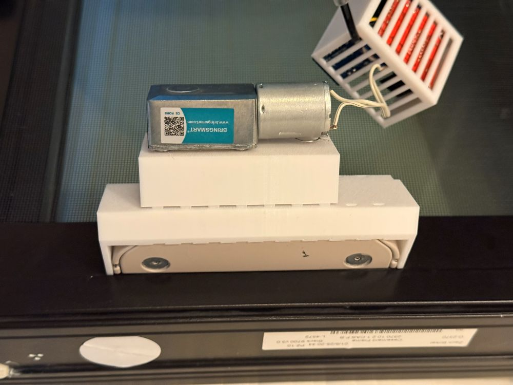
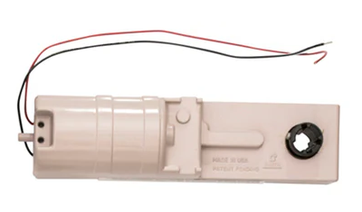
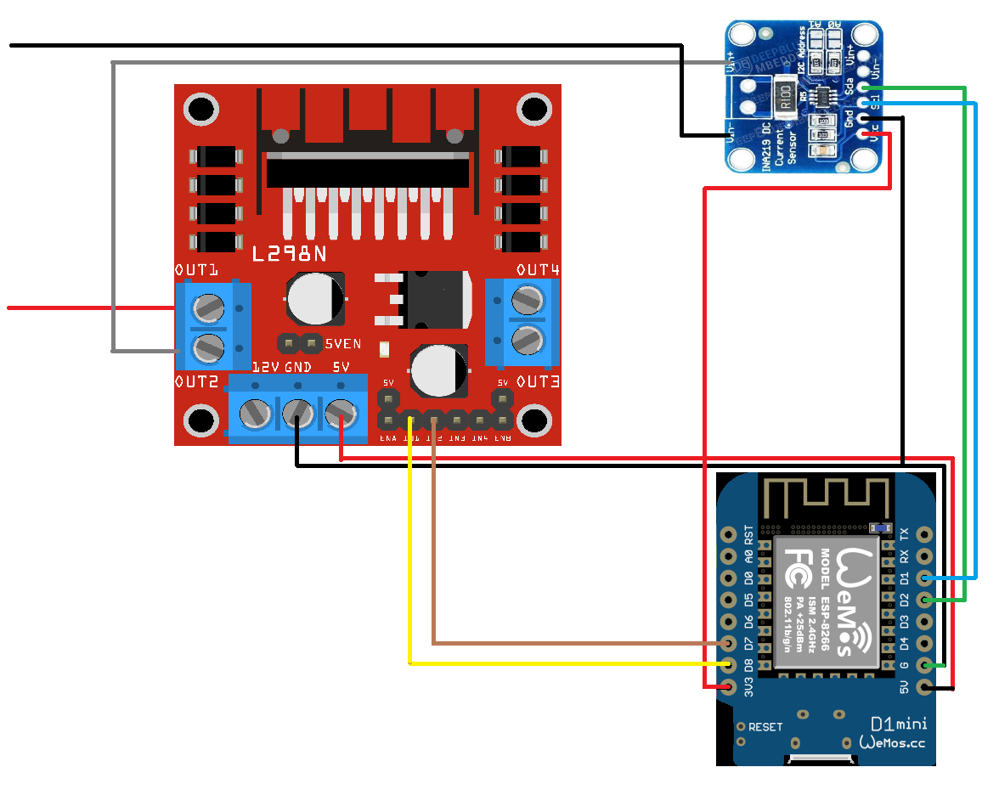

# Automatic Crank Window Opener for Home Assistant

An automated crank window opening system (Work in progress) built with
off-the-shelf components and custom 3D printed mounting brackets,
integrated with [Home Assistant](https://www.home-assistant.io/),
an open source home automation framework.

Despite month of research, I can't seem find an affordable commercial
solution that works with most awning or casement windows sold in the
U.S. Plus, I really, really don't want to bother our AI overlord
hundreds or even thousands mile away, just to open our windows.

So I started looking for DIY solutions. This project is based on the
solution described in [DrZzs' YouTube video](https://youtu.be/Kz8dQG2_uhw) 
with two major changes. First, I use a current sensor to stop the motor,
thus providing safety stop to prevent injury by closing windows.
Second, I tried to build a bracket mounting on the window itself, instead
of on the window sill.

This is very much a work in progress. As a software engineer, I have ZERO
experience in embedded system or mechanical system. And my parts are damn
ugly now.  I put this project on open source platform, hoping to get
suggestions for improvement.

## Existing solutions

Here is a list of the window opener's system and components that I found online.

### Chain Actuators

Either a chain actuator or a pair of linear actuators.
This is probably the most common and affordable solutions online. There
are quite a few manufactures offering this product, price ranging from
$180 to $600 a piece.  They sell either the actuator only, or some
include remote control system with their own app.  I found this
solution is not very bug screen friendly.

### Marvin Automated Windows
Marvin offers fully integrated [automated windows](https://www.marvin.com/products/windows/awning/modern-automated-awning-window). This solution
looks really nice. Expensive too. Looks like we have to bother our AI
overlord for such a chore.

### Truth Crank Window Opener
[Truth Crank Window Opener](https://www.hardwaresource.com/products/truth-sentry-ii-wls-bundle)
seems to be the solution I needed, except for its steep price, and proprietary control system.

They also sell the [motor only](https://www.hardwaresource.com/products/truth-motor-for-sentry-ii-wls) at a lower price. Still pretty expense. 

## Features

The goal is to develop a solution with the following features

- Affordable
- Automated window operation locally, without relying on internet.
- Easy installation, and compatible with most awning window with bug
screens sold in the U.S.
- Safety stop.

## Components

The system is composed of two parts, electronic controls and mechanical parts.

### Mechanical Parts

The idea is to use an electric motor to turn the crank of the manual
opener. So we need a motor, mounting bracket to hold the motor in place,
and a coupler that connect the motor shaft to the crank axle.

We use a [12V DC Motor](https://a.co/d/5XiPb7o), with rated torque 8kg.cm.
This motor has a D shaped output shaft. And the window's crank opener has
a splined axle. To connect them, I designed
[a coupler on OnShape.com](https://cad.onshape.com/documents/2e3dda0369c3ae45dbf63083/w/bd50db0b2dce8fefdb516309/e/54dec64c14440c242481d680) 
and produced the plastic part using a 3d printer.

The mounting bracket has two parts. 
[The first part](https://cad.onshape.com/documents/331d5fca635518b9a628388e/w/96bf5adcff45fe9a51441161/e/dcd096939c3a92a707d13c6b)
clips onto the window crank hardware base. 

The motor, with the coupler connected, is fastened onto 
[the second part](https://cad.onshape.com/documents/f60f016f57ae34cdbcd0bde4/w/6da0c671301cb494ddd860aa/e/70836790cf48bfaddd78782c),
that are later connected to the first part.

The connected bracket is shown in the picture above, bulky and ugly,
partly due to my inferior 3D design skills, partly due to the awkward
connection from the motor's D shaft to the splined axle of the
window hardware.

This is not tested. One potential alternative, is to use a 
[Truth Sentry II motor](https://www.hardwaresource.com/products/truth-motor-for-sentry-ii-wls)
instead. It has the output socket that grabs the splined axle.
This allows the motor to sit close to the crank hardware,
reducing bulk.  A downside is its price, nearly $600 per motor.

### Electronic Control

The control system is composed of a L298N motor controller, an INA219
current sensor, and a D1 Mini. And the wiring diagram:

The D1 Mini is the brain that execute the control logic, it reads motor
current with INA219, and spinning the motor with L298N. We use 
[ESPHome](https://esphome.io/) as a
[Home Assistant](https://www.home-assistant.io/) add on to program this.

### Programming

When a DC motor is running, its current rises when it has to exert
more forces. The plan is to use this to detect motor stalling, either
due to a hand got caught in the closing window, or the window is
fully closed. The motor should be turned off either way.

ESPHome hides a lot of complexity, allow easy configuration using yaml
file. At this point, cranky_conf.yaml file contains all the necessary 
programming.  Quite a bit of embedded C code is used to handle the
complexity that came with motor current sensing and controls.

We could simply set a max current threshold, that when exceeded,
just turn off the motor. Unfortunately, this does not work, since
the current is usually high for a short amount of time when
the motor starts. This short period of high current is called
inrush current. Also, after the window is fully closed, we want
to reverse the motor just a little bit to release the pressure
exerted on the plastic shaft coupler. A complex piece of embedded
C code is used to deal with these complexities. 

